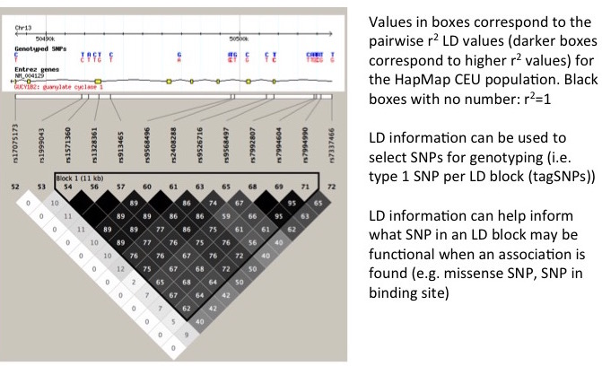
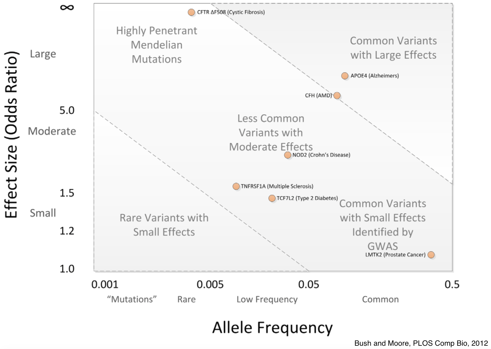
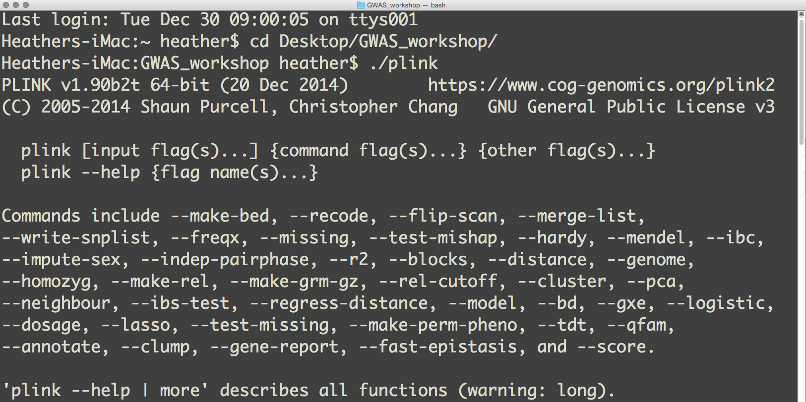
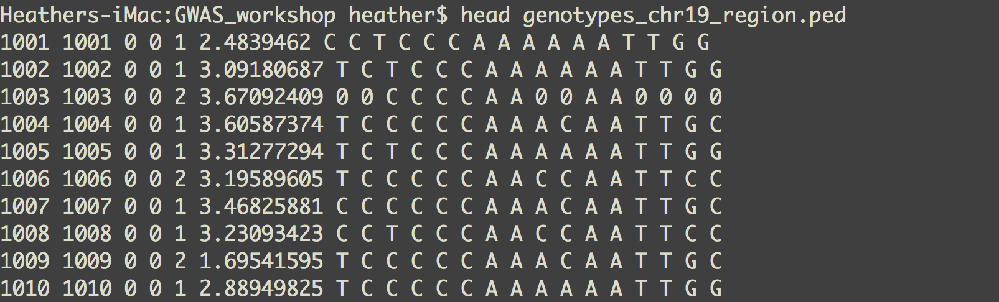
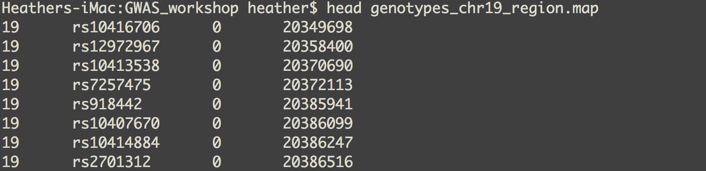
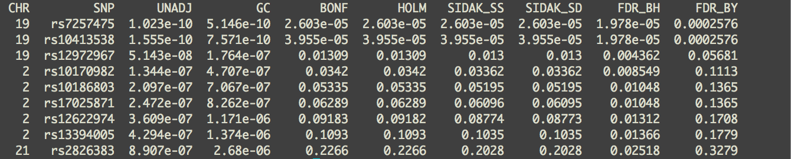
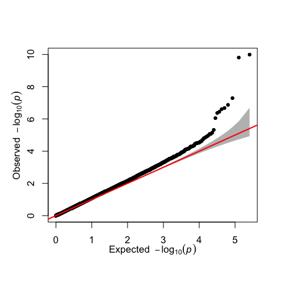
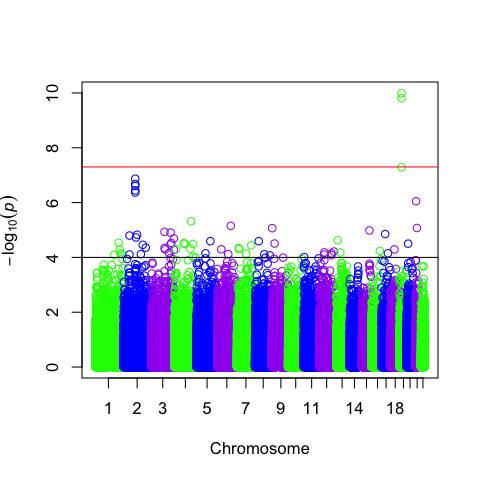
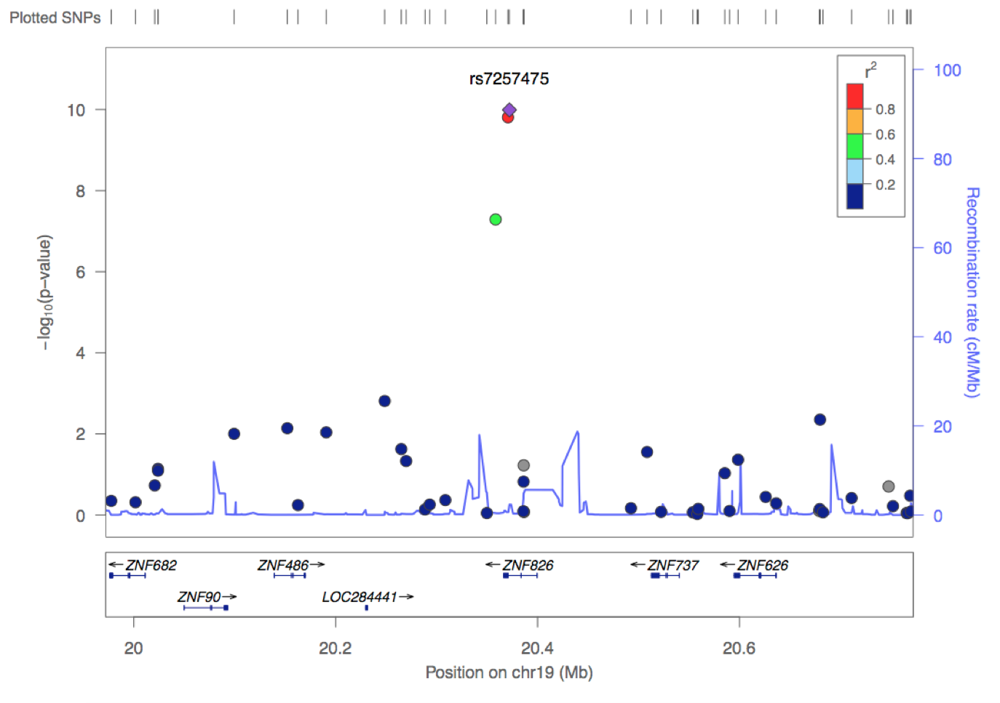
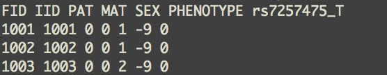

# Genome-wide association studies (GWAS)
- Have emerged over the past ten years as a powerful tool for investigating the genetic architecture of complex traits
- Measures and analyzes DNA sequence variations across the genome and tests them for association with common, complex traits and diseases
- Goal 1: to use discovered genetic risk factors to make predictions about who is at risk for a disease or treatment toxicity
- Goal 2: to identify biological mechanisms of disease susceptibility for development of new prevention and treatment strategies

# Linkage Disequilibrium (LD)


# GWAS usually discovers common variants with small effect sizes


# Topics covered in today's workshop
- Installing R, RStudio, and PLINK
- PLINK data formats
- how to use R for phenotype normalization
- how to use PLINK to conduct a GWAS with pre-processed data
- how to use R to visualize GWAS results

# Topics **NOT** covered in today's workshop, but extremely important
### Perl/Python scripting
- Often used to convert data to plink format

### GWAS Quality Control
- Per SNP call rates
- Per individual call rates
- Gender check
- Mendelian incompatibility check
- Hardy Weinberg equilibrium statistics
- Relationship checking
- Plate effects
- Population stratification/principal components analysis
- Flagging/Filtering of SNPs and individuals

# Installing R and RStudio
### Install R
- Available for Linux/Mac/Windows from CRAN, the Comprehensive R Archive Network
- Download: <http://cran.rstudio.com/>

### Install RStudio
- RStudio is an integrated development environment, a powerful user interface for R
- Download the Open Source RStudio Desktop: <http://www.rstudio.com/products/rstudio/>

# Launch RStudio and test that it is working
```{r,fig.width = 3.5, fig.height = 3.5}
  x <- 1:4
  y <- c(2,4,6,8)
  plot(x,y)
```

# Download GWAS data
- Download the `GWAS_workshop.zip` file from <https://github.com/hwheeler01/GWAS_workshop> 
- Unzip the file and place the **GWAS_workshop** folder on your Desktop.

# Install PLINK
- PLINK is a free, open-source whole genome association analysis toolset, designed to perform a range of basic, large-scale analyses in a computationally efficient manner
- Available for Linux/Mac/Windows(MS-DOS)
- Download: <https://www.cog-genomics.org/plink2>
- Unzip the downloaded file.  Move the file called **plink** or **plink.exe** to your **GWAS_workshop** folder on your Desktop

# Test PLINK
### Using Mac OS X:
Open a Terminal window (If you have not used Terminal before, search for Terminal in a Finder window and double click to open). Type the following commands:
```{r,eval=FALSE}
  cd Desktop/GWAS_workshop/ 
  ./plink
```

### Using Windows:
Open a DOS windows by selecting "Command Prompt" from the start menu, or searching for "command" or "cmd" in the "Run..." option of the start menu. Type the following commands:
```{r,eval=FALSE}
  cd Desktop\GWAS_workshop
  plink
```

# Successful PLINK installation should look like this:


# PLINK .ped file
- First six white-space delimited columns are required:

Family ID      
Individual ID      
Paternal ID      
Maternal ID      
Sex (1=male; 2=female; other=unknown)      
Phenotype 

- Followed by 2n columns (n = number of SNPs) of genotypes



# PLINK .map file
- Exactly four white-space delimited columns required:

chromosome (1-22, X, Y or 0 if unplaced)      
rs# or snp identifier      
Genetic distance (morgans)      
Base-pair position (bp units) 



# Example GWAS Cohort
- GalaxSquid Pharmaceuticals is developing a new cancer drug called GS451
- Some individuals in early phase trials have experienced severe lymphocytopenia (abnormally low lymphocyte counts) 
- The R&D team is performing a GWAS in a panel of lymphoblastoid cell lines (LCLs) from genetically diverse individuals to search for genetic risk factors for lymphocyte toxicity

# Pharmacogenomics: genetics of drug response
```{r fig.width=3, fig.height=2, echo=F, eval=T}
library(png)
library(grid)
img <- readPNG("figs/PGx.png")
 grid.raster(img)
```

\tiny <http://www.pharmainfo.net/reviews/role-pharmacogenomics-drug-development>

# GWAS Phenotype and Genotype Details
- LCLs derived from 176 individuals in the Yoruba population from Nigeria have been treated with increasing concentrations of GS451 to determine the concentration at which 50% viability occurs (IC~50~) for each cell line
- A total of 256,896 SNPs have been genotyped in this cohort

```{r fig.width=3, fig.height=2, echo=F, eval=T}
library(png)
library(grid)
img <- readPNG("figs/ic50.png")
 grid.raster(img)
```

\tiny <http://www.spandidos-publications.com/article_images/or/29/1/OR-29-01-0058-g00.jpg>

# Examine the distribution of the phenotype (IC~50~) in R
```{r}
## read in the data frame
data <- read.table("~/Desktop/GWAS_workshop/GS451_IC50.txt",
                 header=T)

## To view the first few lines of the phenotype data:
data[1:3,]
```

# Examine the distribution of the phenotype (IC~50~) in R
```{r,fig.width = 2.5, fig.height = 2.5}
## To view the distribution of the phenotype, 
## make a histogram:
  
hist(data$GS451_IC50,cex.lab=0.7,cex.main=0.7,cex.axis=0.7)

```

\small The histogram looks skewed to the right (non-normal), so we can try a log2 transformation to make the phenotype more normal

# Transform the phenotype (IC~50~) in R
```{r,fig.width = 2.5, fig.height = 2.5}
log2_GS451_IC50 <- log2(data$GS451_IC50)
hist(log2_GS451_IC50,cex.lab=0.7,cex.main=0.7,cex.axis=0.7)
```

\small This looks better. We can verify the log2-transformed phenotype is consistent with normality by running a Shapiro-Wilk test

# Shapiro-Wilk test
\small Tests the null hypothesis that a sample came from a normally distributed population. P-values < 0.05 indicate a sample is likely not normally distributed.  

```{r}
shapiro.test(data$GS451_IC50)

shapiro.test(log2_GS451_IC50)
```

# Add the log~2~(IC~50~) phenotype to our data file
```{r}
## add transformed data to data frame
data <- cbind(data,log2_GS451_IC50)
## view first few rows
data[1:3,]
## write new data frame to a file
write.table(data,
  file="~/Desktop/GWAS_workshop/GS451_IC50_log2.txt",
  quote=F,row.names=F)
```

# Running the GWAS
To save space and time, we will use a binary ped file (ends with .bed).  Here is a list of the PLINK binary format files we will use:

  `genotypes.bed`      (binary file, genotype information)      
	`genotypes.fam`      (plain text, first six columns of a .ped file)       
	`genotypes.bim`      (plain text, extended MAP file: two extra cols = allele names) 
  
We will also use the separate phenotype file we just generated, which contains the log~2~(IC~50~) phenotype:

  GS451_IC50_log2.txt (plain text, first two cols must contain the family ID (FID) and individual ID (IID).  The following columns contain as many phenotypes as wanted.)

# PLINK command (Run in Terminal or DOS window)
```{r,eval=FALSE}
  ./plink --bfile genotypes --maf 0.05 --linear --adjust 
  --pheno GS451_IC50_log2.txt --pheno-name log2_GS451_IC50 
  --out GS451_L2_IC50
```
\small Here is an explanation of each option used:

\small `--bfile` tells plink your data files that begin with **genotypes** are in binary format

\small `--maf 0.05` tells plink to filter out any SNPs with a minor allele frequency < 0.05

\small `--linear` tells plink to run a linear additive association test for each SNP

\small `--adjust` 	tells plink to adjust the p-values for each SNP using various multiple-testing correction methods

\small `--pheno` 		tells plink the phenotype is located in a separate phenotype file

\small `--pheno-name` 	tells plink the column heading of the phenotype to use in the phenotype file (**log2_GS451_IC50**)

\small `--out` 	tells plink the text to begin each output file (**GS451_L2_IC50**)

# GWAS Output

This run should take a few seconds and produce 3 output files:

  `GS451_L2_IC50.log`
  `GS451_L2_IC50.assoc.linear`
	`GS451_L2_IC50.assoc.linear.adjusted`
  
The `.log` file contains the same information that is output to your screen during the run

# The `.assoc.linear` file contains the results of the linear regression for each SNP


\small Each column means:

\small `CHR`       Chromosome      
\small `SNP`       SNP identifier      
\small `BP`        Physical position (base-pair)      
\small `A1`        Tested allele (minor allele by default)       
\small `TEST`      Code for the test, default `ADD` meaning the additive effects of allele dosage      
\small `NMISS`     Number of non-missing individuals included in analysis      
\small `BETA`      Regression coefficient (slope)
\small `STAT`      Coefficient t-statistic       
\small `P`         p-value for t-statistic 

\small Notice the output is sorted by chromosome and base pair.

# The `.assoc.linear.adjusted` file contains adjusted p-values for each SNP
\small Notice the output is sorted by the most significant results


\small `CHR`         Chromosome number      
\small `SNP`         SNP identifer      
\small `UNADJ`       Unadjusted p-value      
\small `GC`          Genomic-control corrected p-values      
\small `BONF`        Bonferroni single-step adjusted p-values      
\small `HOLM`        Holm (1979) step-down adjusted p-values      
\small `SIDAK_SS`    Sidak single-step adjusted p-values      
\small `SIDAK_SD`    Sidak step-down adjusted p-values      
\small `FDR_BH`      Benjamini & Hochberg (1995) step-up FDR control      
\small `FDR_BY`      Benjamini & Yekutieli (2001) step-up FDR control

#Make a Q-Q Plot and Manhattan Plot in R
```{r,eval=FALSE}
  ## read in results sorted by CHR and BP
  data<-read.table("~/Desktop/GWAS_workshop/
    GS451_L2_IC50.assoc.linear",header=T)
  ## read in R code with plotting functions
  source('~/Desktop/GWAS_workshop/qqman.r')
  ## to make a Q-Q plot called qqplot.png
  png(filename="qqplot.png",res=100)
  qq(data$P)
  dev.off()
  ## to make a Manhattan plot called manplot.png
  png(filename="manplot.png",res=100)
  manhattan(data)
  dev.off()
```

# Your Q-Q Plot should look like this


# Your Manhattan Plot should look like this


# Plot genomic regions of interest using LocusZoom
- LocusZoom is a web-based tool to plot regional association results from genome-wide association scans 
- LocusZoom can take PLINK `.assoc.linear` files as input
- Go to <http://csg.sph.umich.edu/locuszoom/> and click **Plot Using Your Data**

# LocusZoom plot of our top hit rs7257475


# Make boxplot of top SNP using R
- First we must use PLINK to pull out the genotypes of rs7257475 in a format appropriate for R
```{r,eval=FALSE}
./plink --bfile genotypes --snp rs7257475 --recode A 
  --out rs7257475_genotypes
```
This will make the file `rs7257475_genotypes.raw`. The `--recode A` command tells PLINK to output the genotypes in an additive format:


Homozygotes for the major allele are coded as `0`, heterozygotes as `1`, homozygotes for the minor allele as `2`, and missing data as `NA` in `.raw` files. 
`rs7257475_T` indicates that T is the minor allele

# Make boxplot of top SNP using R
\small
```{r,fig.height=3,fig.width=3}
gts<-read.table("~/Desktop/GWAS_workshop/rs7257475_genotypes.raw"
  ,header=T)
pts<-read.table("~/Desktop/GWAS_workshop/GS451_IC50_log2.txt"
  ,header=T)
boxplot(pts$log2_GS451_IC50~gts$rs7257475_T
  ,ylab="GS451 log2(IC50)",xlab="rs7257475 genotype")
```

# Problem Set
Complete the Problem Set located at <https://github.com/hwheeler01/GWAS_workshop>

Embed your answers into the **`problemset.Rmd`** file. Show all your code.